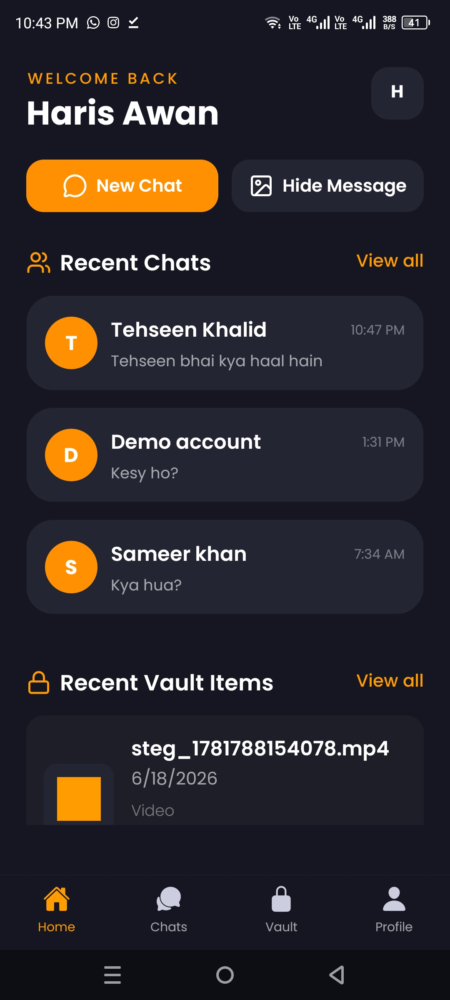
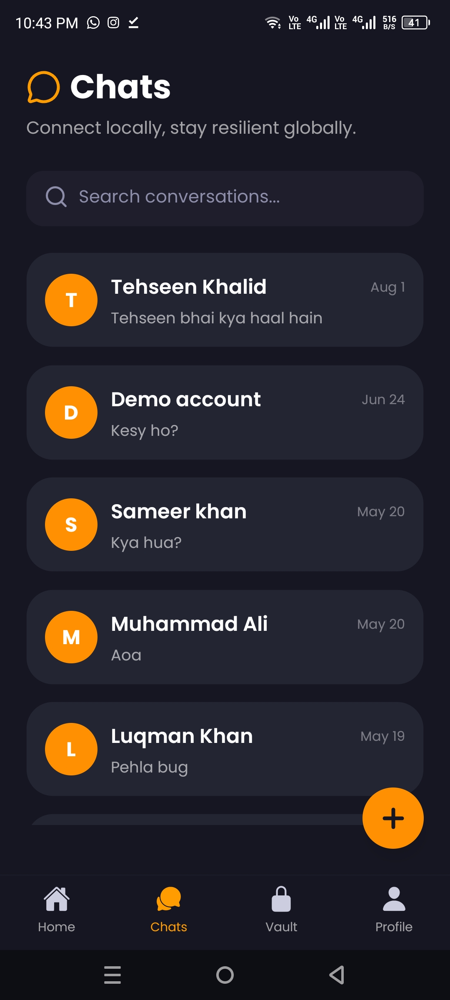
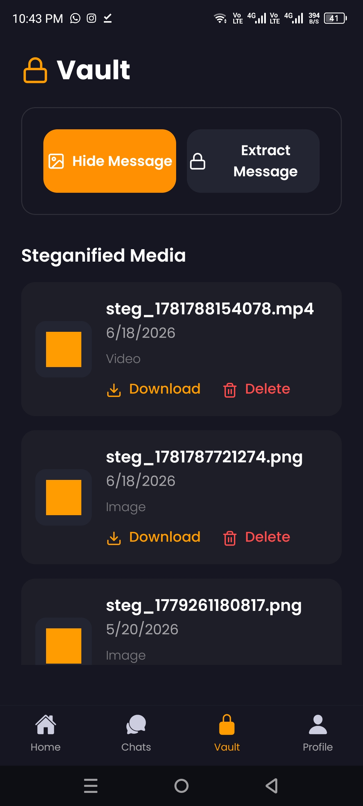
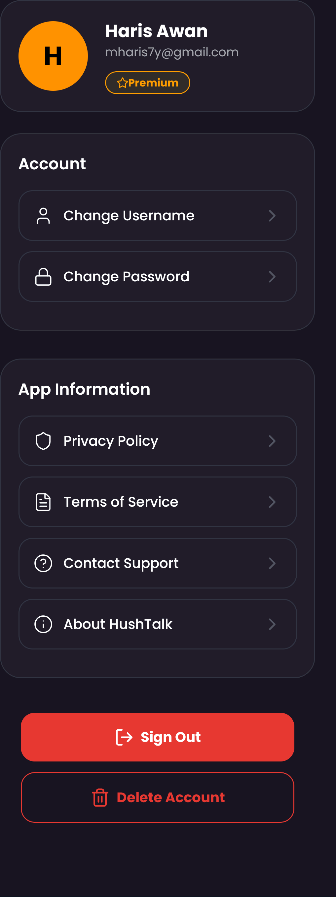
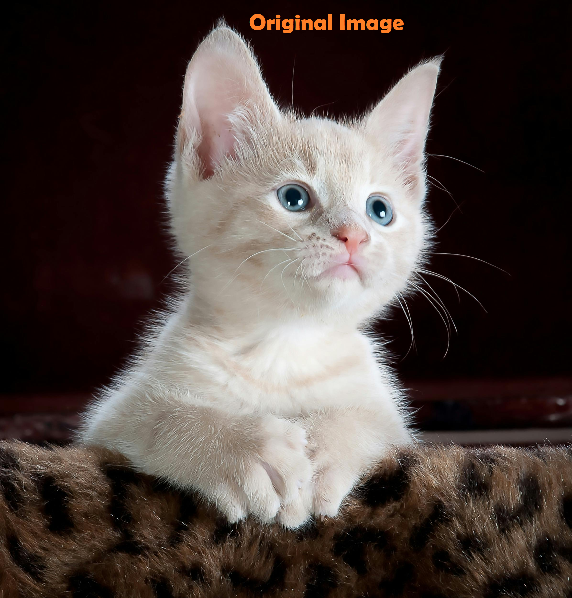
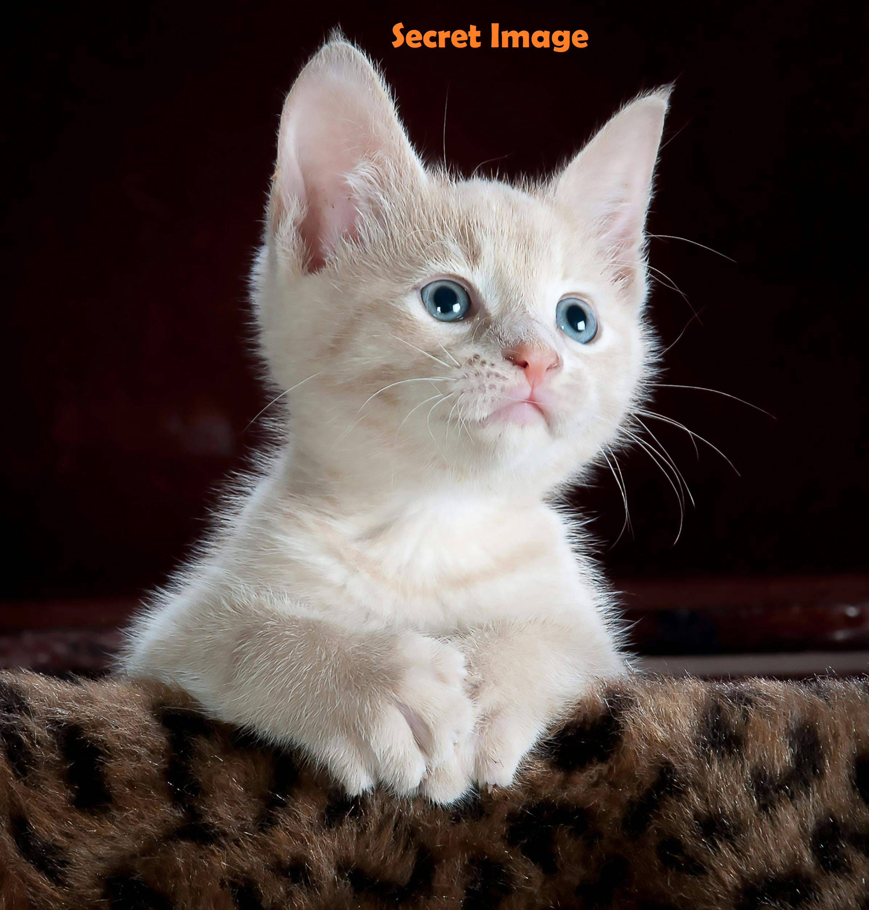

# HushTalk

HushTalk is a secure mobile communication application that combines seamless chat functionality with advanced steganography-based hidden communication. The app allows users to exchange messages normally while providing the ability to conceal highly sensitive information inside images and videos for discreet sharing.

## 📖 Project Overview

The primary objective of HushTalk is to provide a robust and alternative communication platform for local communities, particularly in environments where conventional messaging services may be restricted, monitored, or unavailable. Instead of relying solely on visible text messages or traditional encryption (which can draw attention), HushTalk leverages **steganography techniques** to embed secret messages within everyday media (images and videos). This makes sensitive communication virtually undetectable to unintended observers.

## ✨ Features

- **User Authentication**: Secure user onboarding and authentication powered by Firebase.
- **One-to-One Chat**: Real-time messaging with a clean, intuitive interface for seamless communication.
- **Image Steganography**: Effortlessly hide secret text messages inside standard images. The modified images look identical to the naked eye but carry encrypted data.
- **Video Steganography**: Advanced capability to encode and extract secret messages within video files, allowing for larger payloads while remaining visually unchanged.
- **Secure Vault**: A dedicated, protected area to manage and store your previously steganofied images and videos safely.
- **Profile Management**: Customize and manage user profiles securely.

## 🛠️ Packages Used

HushTalk is built using a modern mobile stack to ensure performance, security, and a great user experience:

### Core Frameworks
- **React Native** & **Expo**: For cross-platform mobile development and rapid iteration.
- **Expo Router** & **React Navigation**: For deep linking and seamless app navigation.

### Backend & Storage
- **Firebase** (`@react-native-firebase/auth`, `@react-native-firebase/firestore`): For real-time database capabilities and secure user authentication.
- **Appwrite** (`react-native-appwrite`): For robust and secure media storage in the cloud.
- **Async Storage** (`@react-native-async-storage/async-storage`): For secure local data persistence.

### UI & Styling
- **NativeWind** & **TailwindCSS**: For utility-first, responsive, and beautiful styling across the app.
- **Lucide React Native** & **Expo Vector Icons**: For crisp, scalable iconography.
- **Expo Image** & **Expo Image Picker**: For optimized media rendering and device gallery selection.

### Security & Steganography
- **AES-JS**: For Advanced Encryption Standard (AES) encryption of messages prior to embedding them in media.
- **lzutf8** & **varint**: For highly efficient data compression and encoding.
- **Custom Native Android Modules**: Specifically built in Java/Kotlin for heavy media processing and complex steganography algorithms on the device.

## 📱 Screenshots

Here is a glimpse of HushTalk in action:

  
  &nbsp;&nbsp;&nbsp;
  
  &nbsp;&nbsp;&nbsp;
  
  &nbsp;&nbsp;&nbsp;
  

- **Home Screen**: Main dashboard for accessing recent conversations and navigating to steganography tools.
- **Chats Screen**: Real-time one-to-one messaging interface.
- **Vault Screen**: Secure local storage view for all your hidden and encrypted media files.
- **Profile Screen**: Manage your account details, avatar, and preferences.

### 🕵️ Steganography in Action

Below is a demonstration of our image steganography. The original image and the secret image (which contains an encrypted, hidden text message) look completely identical to the naked eye, ensuring your sensitive data remains undetected.

  <figure style="display: inline-block; text-align: center;">
    
    <figcaption><b>Original Image</b></figcaption>
  </figure>
  &nbsp;&nbsp;&nbsp;&nbsp;&nbsp;&nbsp;
  <figure style="display: inline-block; text-align: center;">
    
    <figcaption><b>Secret Image (Contains Hidden Data)</b></figcaption>
  </figure>

